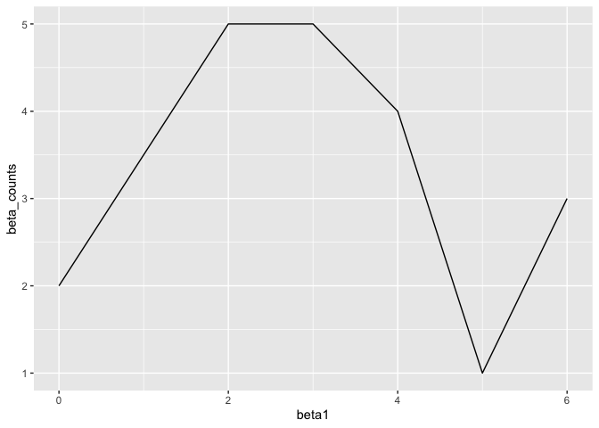
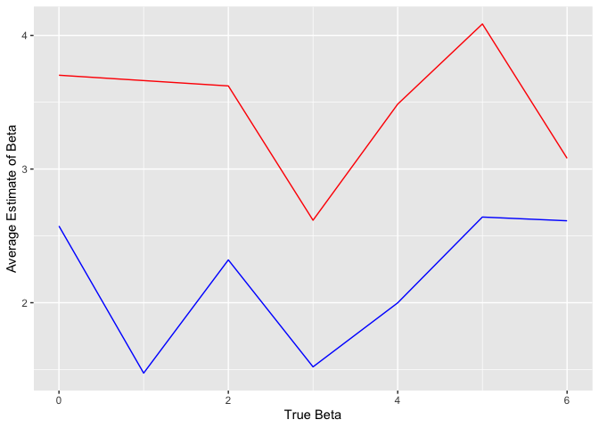

p8105\_hw5\_mm5351
================
Martha Mulugeta
11/6/2019

**Problem 1**

``` r
iris_fill = function(x) {
  if (is.numeric(x)) {
    replace_na(x, mean(x, na.rm = TRUE))
  } else if (is.character(x)) {
    replace_na(x, "virginica")
  }
}

output = map_df(iris_with_missing, iris_fill) 
```

**Problem 2**

``` r
study_df = tibble(
participant = list.files(path = "./Data", pattern = ".csv",  all.files = TRUE, full.names = TRUE)) %>% 
  mutate(data = map(participant, read_csv)) %>% 
  unnest() 
```

    ## Parsed with column specification:
    ## cols(
    ##   week_1 = col_double(),
    ##   week_2 = col_double(),
    ##   week_3 = col_double(),
    ##   week_4 = col_double(),
    ##   week_5 = col_double(),
    ##   week_6 = col_double(),
    ##   week_7 = col_double(),
    ##   week_8 = col_double()
    ## )
    ## Parsed with column specification:
    ## cols(
    ##   week_1 = col_double(),
    ##   week_2 = col_double(),
    ##   week_3 = col_double(),
    ##   week_4 = col_double(),
    ##   week_5 = col_double(),
    ##   week_6 = col_double(),
    ##   week_7 = col_double(),
    ##   week_8 = col_double()
    ## )
    ## Parsed with column specification:
    ## cols(
    ##   week_1 = col_double(),
    ##   week_2 = col_double(),
    ##   week_3 = col_double(),
    ##   week_4 = col_double(),
    ##   week_5 = col_double(),
    ##   week_6 = col_double(),
    ##   week_7 = col_double(),
    ##   week_8 = col_double()
    ## )
    ## Parsed with column specification:
    ## cols(
    ##   week_1 = col_double(),
    ##   week_2 = col_double(),
    ##   week_3 = col_double(),
    ##   week_4 = col_double(),
    ##   week_5 = col_double(),
    ##   week_6 = col_double(),
    ##   week_7 = col_double(),
    ##   week_8 = col_double()
    ## )
    ## Parsed with column specification:
    ## cols(
    ##   week_1 = col_double(),
    ##   week_2 = col_double(),
    ##   week_3 = col_double(),
    ##   week_4 = col_double(),
    ##   week_5 = col_double(),
    ##   week_6 = col_double(),
    ##   week_7 = col_double(),
    ##   week_8 = col_double()
    ## )
    ## Parsed with column specification:
    ## cols(
    ##   week_1 = col_double(),
    ##   week_2 = col_double(),
    ##   week_3 = col_double(),
    ##   week_4 = col_double(),
    ##   week_5 = col_double(),
    ##   week_6 = col_double(),
    ##   week_7 = col_double(),
    ##   week_8 = col_double()
    ## )
    ## Parsed with column specification:
    ## cols(
    ##   week_1 = col_double(),
    ##   week_2 = col_double(),
    ##   week_3 = col_double(),
    ##   week_4 = col_double(),
    ##   week_5 = col_double(),
    ##   week_6 = col_double(),
    ##   week_7 = col_double(),
    ##   week_8 = col_double()
    ## )
    ## Parsed with column specification:
    ## cols(
    ##   week_1 = col_double(),
    ##   week_2 = col_double(),
    ##   week_3 = col_double(),
    ##   week_4 = col_double(),
    ##   week_5 = col_double(),
    ##   week_6 = col_double(),
    ##   week_7 = col_double(),
    ##   week_8 = col_double()
    ## )
    ## Parsed with column specification:
    ## cols(
    ##   week_1 = col_double(),
    ##   week_2 = col_double(),
    ##   week_3 = col_double(),
    ##   week_4 = col_double(),
    ##   week_5 = col_double(),
    ##   week_6 = col_double(),
    ##   week_7 = col_double(),
    ##   week_8 = col_double()
    ## )
    ## Parsed with column specification:
    ## cols(
    ##   week_1 = col_double(),
    ##   week_2 = col_double(),
    ##   week_3 = col_double(),
    ##   week_4 = col_double(),
    ##   week_5 = col_double(),
    ##   week_6 = col_double(),
    ##   week_7 = col_double(),
    ##   week_8 = col_double()
    ## )
    ## Parsed with column specification:
    ## cols(
    ##   week_1 = col_double(),
    ##   week_2 = col_double(),
    ##   week_3 = col_double(),
    ##   week_4 = col_double(),
    ##   week_5 = col_double(),
    ##   week_6 = col_double(),
    ##   week_7 = col_double(),
    ##   week_8 = col_double()
    ## )
    ## Parsed with column specification:
    ## cols(
    ##   week_1 = col_double(),
    ##   week_2 = col_double(),
    ##   week_3 = col_double(),
    ##   week_4 = col_double(),
    ##   week_5 = col_double(),
    ##   week_6 = col_double(),
    ##   week_7 = col_double(),
    ##   week_8 = col_double()
    ## )
    ## Parsed with column specification:
    ## cols(
    ##   week_1 = col_double(),
    ##   week_2 = col_double(),
    ##   week_3 = col_double(),
    ##   week_4 = col_double(),
    ##   week_5 = col_double(),
    ##   week_6 = col_double(),
    ##   week_7 = col_double(),
    ##   week_8 = col_double()
    ## )
    ## Parsed with column specification:
    ## cols(
    ##   week_1 = col_double(),
    ##   week_2 = col_double(),
    ##   week_3 = col_double(),
    ##   week_4 = col_double(),
    ##   week_5 = col_double(),
    ##   week_6 = col_double(),
    ##   week_7 = col_double(),
    ##   week_8 = col_double()
    ## )
    ## Parsed with column specification:
    ## cols(
    ##   week_1 = col_double(),
    ##   week_2 = col_double(),
    ##   week_3 = col_double(),
    ##   week_4 = col_double(),
    ##   week_5 = col_double(),
    ##   week_6 = col_double(),
    ##   week_7 = col_double(),
    ##   week_8 = col_double()
    ## )
    ## Parsed with column specification:
    ## cols(
    ##   week_1 = col_double(),
    ##   week_2 = col_double(),
    ##   week_3 = col_double(),
    ##   week_4 = col_double(),
    ##   week_5 = col_double(),
    ##   week_6 = col_double(),
    ##   week_7 = col_double(),
    ##   week_8 = col_double()
    ## )
    ## Parsed with column specification:
    ## cols(
    ##   week_1 = col_double(),
    ##   week_2 = col_double(),
    ##   week_3 = col_double(),
    ##   week_4 = col_double(),
    ##   week_5 = col_double(),
    ##   week_6 = col_double(),
    ##   week_7 = col_double(),
    ##   week_8 = col_double()
    ## )
    ## Parsed with column specification:
    ## cols(
    ##   week_1 = col_double(),
    ##   week_2 = col_double(),
    ##   week_3 = col_double(),
    ##   week_4 = col_double(),
    ##   week_5 = col_double(),
    ##   week_6 = col_double(),
    ##   week_7 = col_double(),
    ##   week_8 = col_double()
    ## )
    ## Parsed with column specification:
    ## cols(
    ##   week_1 = col_double(),
    ##   week_2 = col_double(),
    ##   week_3 = col_double(),
    ##   week_4 = col_double(),
    ##   week_5 = col_double(),
    ##   week_6 = col_double(),
    ##   week_7 = col_double(),
    ##   week_8 = col_double()
    ## )
    ## Parsed with column specification:
    ## cols(
    ##   week_1 = col_double(),
    ##   week_2 = col_double(),
    ##   week_3 = col_double(),
    ##   week_4 = col_double(),
    ##   week_5 = col_double(),
    ##   week_6 = col_double(),
    ##   week_7 = col_double(),
    ##   week_8 = col_double()
    ## )

    ## Warning: `cols` is now required.
    ## Please use `cols = c(data)`

``` r
study_df = 
  study_df %>%
  separate(col = participant, sep = "_", into = c("arm", "subjectID")) %>% 
  mutate(
    arm = str_replace(arm, "./Data/", ""),
    subjectID = str_replace(subjectID, ".csv", "")
  ) %>% 

 pivot_longer(
    week_1:week_8,
    names_to = "week",
    values_to = "observation"
  ) %>%
  mutate(week = str_replace(week, "week_", "")) %>%
  unite(participant, arm, subjectID, sep = " ", remove = FALSE) %>% 
  group_by(week, participant) 
  
study_df %>%  
ggplot(aes(x = week, y = observation, color = participant, group = participant)) +
  geom_line() + 
     labs(
    title = "Observations Over Time",
    x = "Week",
    y = "Observation")
```

<!-- -->

**Problem 3**

``` r
sim_regression = function(n = 30, beta0 = 2, beta1 = 0) {
   sim_data = tibble(
    x = rnorm(n),
    y = beta0 + beta1 * x + rnorm(n, 0, sqrt(50))
  )
  
ls_fit = lm(y ~ x, data = sim_data) %>% 
  broom::tidy()
}
```

``` r
sim_results = 
  tibble(
    beta1 = c(0, 1, 2, 3, 4, 5, 6)) %>% 
  mutate(
    output_list = map(.x = beta1, ~rerun(10, sim_regression(beta1 = .x))),
    output_df = map(output_list, bind_rows)
  ) %>% 
  select(-output_list) %>% 
  unnest(output_df)
```

Make a plot showing the proportion of times the null was rejected (the
power of the test) on the y axis and the true value of β1 on the x axis.
Describe the association between effect size and power.

``` r
beta1_0 = 
  sim_results %>% 
  filter(term == "(Intercept)") %>% 
  select(beta1, p.value) %>% 
  count(beta1, p.value) %>% 
  mutate(
    total = sum(n)
  ) %>% 
  filter(beta1 == 0, p.value < 0.05) %>% 
  count(beta1, p.value) %>% 
  mutate(
    total_reject = sum(n)) 

beta1_1 =
  sim_results %>% 
  filter(term == "(Intercept)") %>% 
  select(beta1, p.value) %>% 
  count(beta1, p.value) %>% 
  mutate(
    total = sum(n)
  ) %>% 
  filter(beta1 == 1, p.value < 0.05) %>% 
  count(beta1, p.value) %>% 
  mutate(
    total_reject = sum(n)) 

beta1_2 =
  sim_results %>% 
  filter(term == "(Intercept)") %>% 
  select(beta1, p.value) %>% 
  count(beta1, p.value) %>% 
  mutate(
    total = sum(n)
  ) %>% 
  filter(beta1 == 2, p.value < 0.05) %>% 
  count(beta1, p.value) %>% 
  mutate(
    total_reject = sum(n)) 

beta1_3 =
  sim_results %>% 
  filter(term == "(Intercept)") %>% 
  select(beta1, p.value) %>% 
  count(beta1, p.value) %>% 
  mutate(
    total = sum(n)
  ) %>% 
  filter(beta1 == 3, p.value < 0.05) %>% 
  count(beta1, p.value) %>% 
  mutate(
    total_reject = sum(n)) 

beta1_4 =
  sim_results %>% 
  filter(term == "(Intercept)") %>% 
  select(beta1, p.value) %>% 
  count(beta1, p.value) %>% 
  mutate(
    total = sum(n)
  ) %>% 
  filter(beta1 == 4, p.value < 0.05) %>% 
  count(beta1, p.value) %>% 
  mutate(
    total_reject = sum(n)) 

beta1_5 =
  sim_results %>% 
  filter(term == "(Intercept)") %>% 
  select(beta1, p.value) %>% 
  count(beta1, p.value) %>% 
  mutate(
    total = sum(n)
  ) %>% 
  filter(beta1 == 5, p.value < 0.05) %>% 
  count(beta1, p.value) %>% 
  mutate(
    total_reject = sum(n)) 

beta1_6 =
  sim_results %>% 
  filter(term == "(Intercept)") %>% 
  select(beta1, p.value) %>% 
  count(beta1, p.value) %>% 
  mutate(
    total = sum(n)
  ) %>% 
  filter(beta1 == 6, p.value < 0.05) %>% 
  count(beta1, p.value) %>% 
  mutate(
    total_reject = sum(n)) 

beta1_6 =
  sim_results %>% 
  filter(term == "(Intercept)") %>% 
  select(beta1, p.value) %>% 
  count(beta1, p.value) %>% 
  mutate(
    total = sum(n)
  ) %>% 
  filter(beta1 == 6, p.value < 0.05) %>% 
  count(beta1, p.value) %>% 
  mutate(
    total_reject = sum(n)) 
```

``` r
reject_null = function(x) {
  sim_results %>% 
  filter(term == "(Intercept)") %>% 
  select(beta1, p.value) %>% 
  filter(p.value < 0.05) 
}

reject_null(x)
```

    ## # A tibble: 21 x 2
    ##    beta1  p.value
    ##    <dbl>    <dbl>
    ##  1     0 0.0156  
    ##  2     0 0.0101  
    ##  3     0 0.0173  
    ##  4     0 0.000311
    ##  5     0 0.00444 
    ##  6     2 0.000249
    ##  7     2 0.0421  
    ##  8     2 0.00436 
    ##  9     3 0.0269  
    ## 10     4 0.000943
    ## # … with 11 more rows

``` r
reject_null =
  sim_results %>% 
  filter(term == "(Intercept)") %>% 
  select(beta1, p.value) %>% 
  count(beta1, p.value) %>% 
  mutate(
    total = sum(n)
  ) %>% 
  filter(p.value < 0.05) %>% 

mutate(beta_counts = if_else(beta1 == 0, 2, if_else(beta1 == 1, 3, if_else(beta1 == 2, 5, if_else(beta1 == 3, 5, if_else(beta1 == 4, 4, if_else(beta1 == 5, 1, if_else(beta1 == 6, 3, NA_real_))))))))
```

``` r
reject_null %>% 
  ggplot(aes(x = beta1, y = beta_counts)) +
  geom_line()
```

<!-- -->

``` r
average_estimates =
  sim_results %>% 
  filter(term == "(Intercept)") %>% 
  select(beta1, estimate, p.value) %>% 
  group_by(beta1) %>% 
  mutate(mean_estimate = mean(estimate)) 

average_reject = 
  sim_results %>% 
  filter(term == "(Intercept)", p.value < 0.05) %>% 
  select(beta1, estimate, p.value) %>% 
  group_by(beta1) %>% 
  mutate(mean_estimate = mean(estimate)) 

ggplot() +
  geom_line(data = average_estimates, aes(x = beta1, y = mean_estimate), color = 'blue') +
  geom_line(data = average_reject, aes(x = beta1, y = mean_estimate), color = 'red') +
  xlab('True Beta') +
  ylab('Average Estimate of Beta') 
```

<!-- -->
